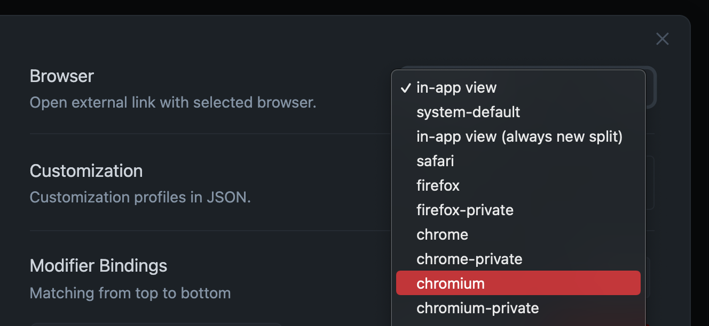

# obsidian-open-link-with

Open external link with specific browser in Obsidian

## Installation

### Manual installation

Download zip archive from [releases page](https://github.com/MamoruDS/obsidian-open-link-with/releases). Extract the archive into `<your vault>/.obsidian/plugins`
Enable `Open Link With` under `Settings > Community plugins > Installed Plugins`

## Usage

Select which browser you want to open external link with in plugin's setting menu.

<p align="center">

</p>

### Customization

Put your custom profile in plugin's setting menu. Profile should contain `name(string): commands(string[])` which is demonstrated in the following:
_PS._ If the name in the user defined profile is same as the preset, it will be _ignored_.

```json
{
    "opera": [
        "c:/Users/mamoru/AppData/Local/Programs/Opera/launcher.exe"
    ],
    "opera-private": [
        "c:/Users/mamoru/AppData/Local/Programs/Opera/launcher.exe",
        "--private"
    ]
}
```

## Changelog

[link](./CHANGELOG.md) of changelogs.
